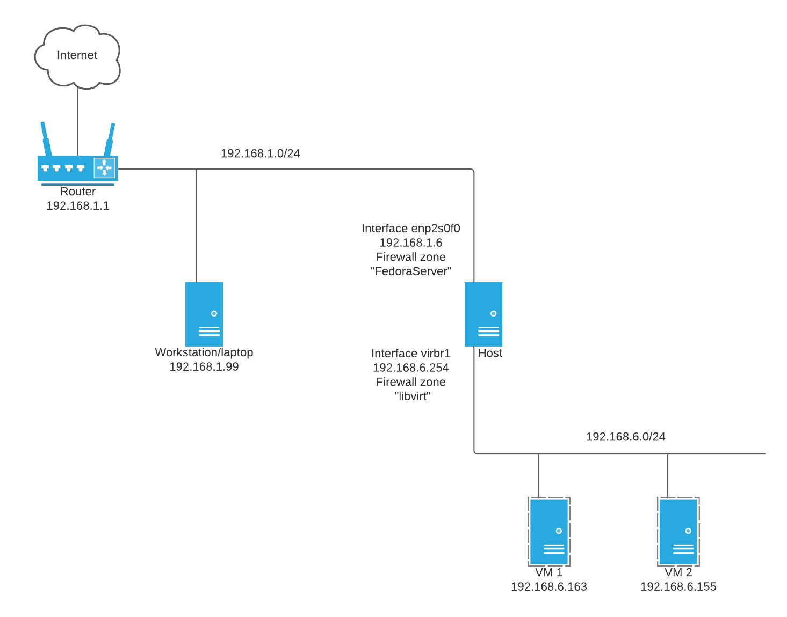

## Introduction

If you're reading this you may have searched the web for "libvirt routed firewalld" or something similar. 

This article is all about enabling the following configuration on a Red Hat Enterprise Linux/CentOS/Fedora or similar host:
- VMs running in your machine with libvirt
- Routed networks for the VMs (rather than the default NAT setup libvirt uses)
- Firewalld with NFTables as the back-end to protect your host and guests

This seems like it should all be pretty easy, right?  Routed networks with libvirt are relatively straightforward by themselves, and firewalld is also straightforward to configure.  Both are quite well documented, however I couldn't get them to work together.

Here's my desired configuration to route traffic from my workstation (laptop) and my VMs hosted on my hypervisor host:


## What's the challenge?

After much research and troubleshooting I learned that firewalld was rejecting incoming ping and SSH packets, with error messages in the logs (which appear in /var/log/messages and the output of `dmesg` when enabled).  Here's an example of me trying to SSH from my workstation (192.168.1.99) to a VM at 192.168.6.163:

```
[Wed Jan 19 12:12:31 2022] "filter_FWD_FedoraServer_REJECT: "IN=enp2s0f0 OUT=virbr1 MAC=98:f2:b3:e9:09:98:dc:fb:48:bd:15:be:08:00 SRC=192.168.1.99 DST=192.168.6.163 LEN=60 TOS=0x08 PREC=0x40 TTL=63 ID=38395 DF PROTO=TCP SPT=49618 DPT=22 WINDOW=64240 RES=0x00 SYN URGP=0 
```

## How do we fix it?

This tells me that the FedoraServer zone is rejecting my request.  Why?  It turns out that the Firewalld+nftables filter_FORWARD chain prevents non-NATed routing.  However, forwarding is possible using the "Policy Objects" feature that was implemented in firewalld around 2020.

You can read more here:

[Policy Objects: Introduction](https://firewalld.org/2020/09/policy-objects-introduction)

[Policy Objects: Filtering Container and Virtual Machine Traffic](https://firewalld.org/2020/09/policy-objects-filtering-container-and-vm-traffic)

## What does the firewalld configuration look like?

So with all this info in hand we can create some simple rules that allow forwarding of traffic between two zones without requiring a NAT (masquerade):

Host to VMs
```
firewall-cmd --permanent --new-policy hostToLibvirt
firewall-cmd --permanent --policy hostToLibvirt --set-target ACCEPT
firewall-cmd --permanent --policy hostToLibvirt --add-ingress-zone FedoraServer
firewall-cmd --permanent --policy hostToLibvirt --add-egress-zone libvirt
```

VMs to host
```
firewall-cmd --permanent --new-policy libvirtToHost
firewall-cmd --permanent --policy libvirtToHost --set-target ACCEPT
firewall-cmd --permanent --policy libvirtToHost --add-ingress-zone libvirt
firewall-cmd --permanent --policy libvirtToHost --add-egress-zone FedoraServer
```

Reload the config
```
firewall-cmd --reload
```

With the above configuration we can now happily route traffic from my workstation to and from the VMs via the hypervisor host, without NAT being required.  This has the hypervisor host effectively acting as a transit router.

It should be noted that all traffic entering each zone is subject to the rules of that zone.  Any services or ports allowed or denied will be respected as one would expect.

Another thing to note is that the policies above set the target to ACCEPT, but it may make more sense to set them to CONTINUE, allowing other policies to be processed in systems with a more complex configuration.  You can find more reading here: [firewalld.policy](https://firewalld.org/documentation/man-pages/firewalld.policy.html)

## Wrap up

To summarise, this firewalld configuration allows us to firewall traffic to the host (hypervisor), and forward traffic to and from the guest VMs.  Any further firewalling of ingress traffic into each VM is then the responsibility of each VM itself.

Special thanks to [erig0](https://github.com/erig0) and [space88man](https://github.com/space88man) on Github for pointing me in the right direction.
